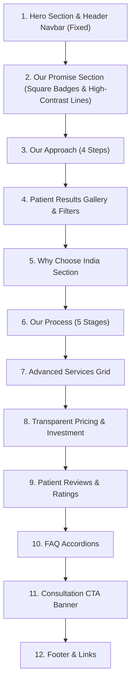

# Realdense Web — Figma Design & Component Implementation Report

**Figma File**: `Realdense web (Copy)`  
**Figma File Key**: `sr2znFAWlrfvsYNHtSYjYz`  
**Canvas Size**: `1890px` (Width) × `16,680px` (Height)  
**Primary Page**: `Home page` (Node ID `1:2`)

---

## 1. Design System & Visual Tokens

### A. Typography
- **Primary Font Family**: `Plus Jakarta Sans` (100% of text elements)
- **Font Weights Used**:
  - `ExtraBold` (800): Main Hero titles, section splash headlines
  - `Bold` (700): Section headers, card titles, pricing numbers
  - `SemiBold` (600): Navigation links, button labels, badges
  - `Medium` (500): Subheadings, body copy, description text
  - `Regular` (400): Footer legal text, metadata

### B. Curated Color Palette
| Token Role | Hex Code / Tailwind | Visual Description & Usage |
| :--- | :--- | :--- |
| **Primary Brand Navy** | `#0c246c`, `#001e56`, `#0B2545` | Deep medical blue used for main headings, hero accents, section titles |
| **Secondary Deep Blue** | `#0d2c8a`, `#011e58` | Dark background cards, process steps, contrast containers |
| **Brand Cyan Accent** | `#0cb0f2`, `#00a8ff`, `#0196e3` | Vibrant cyan blue for CTA buttons, interactive highlights, active tabs, eyebrow accents |
| **Light Blue Tint** | `#dcf1fd`, `#cceafe`, `#e9f4fd`, `#edf6fe` | Glassmorphism card fills, pill badges, icon container default fills |
| **Slate & Divider Neutrals** | `#64748B`, `#94a3b8`, `#cbd5e1` | Eyebrow text, high-opacity trailing lines, responsive grid card separators |
| **Warm Gold Accent** | `#ffbb1f` | Star ratings, badges, highlight tags (e.g. *MOST POPULAR*) |
| **Neutrals** | `#ffffff`, `#000000`, `#d9d9d9` | Clean white cards/backgrounds, dark body text, subtle border lines |

---

## 2. Updated Component Architecture & Design Patterns

### A. Sticky & Fixed Header Navigation (`Navbar.tsx`)
- **Full-Page Fixed Positioning**: Header uses `fixed top-0 left-0 right-0 z-50` to maintain visibility throughout full page scrolling.
- **Scroll-Aware Backdrop**: Switches dynamically on scroll (`scrollY > 12px`) to `bg-white/90 backdrop-blur-md shadow-[0_4px_24px_rgba(0,30,86,0.08)]`.
- **Desktop Navigation**: Features service dropdown panel (`FUE`, `DHI`, `Sapphire FUE`, `Hairline`, `Beard`, `Eyebrow`) with smooth hover micro-animations and active indicator dots.
- **Mobile Drawer**: Animated slide-down navigation menu with accordion sub-menus and quick consultation CTA button.

### B. Hero Banner (`HomePage.tsx` & `HeroBackground.tsx`)
- **Background Layer**: `BlueWaveBackground` SVG ambient curve vector with dot matrix overlay.
- **Eyebrow Label**: Increased font size to `14px` (`BECAUSE LOOK MATTERS.`), tracking `0.25em` in cyan (`#0cb0f2`).
- **Primary CTA**: Deep navy (`#001e56`) filled pill button with right arrow icon (`→`).
- **Secondary CTA**: Outlined button (`border-[#c8d6e5] text-[#0B2545]`) featuring an interactive solid cyan hover fill (`hover:bg-[#0196E3] hover:text-white hover:border-[#0196E3]`).
- **Before/After Interactive Cards**: Dual-image comparison cards with rounded corners (`radius="9%"` and `"7%"`), pill badges (`BEFORE` / `AFTER`), and overlapping side-by-side positioning.

### C. Our Promise Section (`OurPromise.tsx`)
- **Section Header**:
  - **Eyebrow**: `"OUR PROMISE"` with an updated high-contrast trailing divider line (`h-[2px] w-8 sm:w-10 rounded-full bg-[#94a3b8]`).
  - **Headline**: `"Your Hair. Our Commitment."` with linear cyan gradient text.
- **Icon Container Badges**:
  - Converted from circular to **Square Badges** (`rounded-xl` on highlight/hover, `w-12 h-12 flex items-center justify-center`).
- **Responsive Card Grid & Separator Dividers**:
  - **Highlighted State**: Card 1 ("Personalised Treatment Plans") highlighted by default with cyan gradient fill (`from-[#e3f4fd] to-[#c7e8fd]`), soft glow shadow (`shadow-[0_12px_32px_rgba(12,176,242,0.18)]`), and border.
  - **Grid Separators**: Precise mobile, tablet (2-col), and desktop (3-col) horizontal (`h-[2px]`) and vertical (`w-[2px]`) border line separators (`bg-[#cbd5e1]` default, `bg-[#94d5f7]` when card is active).

---

## 3. Detailed Page Breakdown (12 Key Sections)

### Section 1: Top Navigation & Hero Banner
- **Header**: Fixed navbar across page scroll with logo, navigation links, services dropdown, and mobile drawer.
- **Tagline**: `BECAUSE LOOK MATTERS.` (`14px` uppercase cyan `#0cb0f2`).
- **Headline**: `A Fuller Hairline, A Stronger You` (`50px` / `60px` ExtraBold with cyan gradient).
- **Sub-headline**: `Advanced hair restoration designed around you, with natural-looking results that feel completely your own.`
- **CTAs**:
  - `Book a Consultation →` (Primary Navy Button `#001e56`)
  - `Explore Treatments` (Outlined Button with Cyan Hover Fill `#0196E3`)
- **Trust Badges**: Avatar stack + `2,000+ happy patients` | `4.9/5 rating`
- **Hero Visual**: Ambient wave SVG + Before/After showcase cards.

### Section 2: Our Promise ("Your Hair. Our Commitment.")
- **Headline**: `Your Hair. Our Commitment.`
- **Eyebrow**: `OUR PROMISE` + high-contrast `2px` trailing line (`#94a3b8`).
- **6 Key Pillars (Square Icon Badges + Separator Lines)**:
  1. *Safe & Proven Techniques*: Clinically proven methods.
  2. *Personalised Treatment Plans*: Customized plan (Default highlighted card).
  3. *Expert Care & Support*: Guidance from consultation to recovery.
  4. *Natural-Looking Results*: Seamless blending with existing hair.
  5. *Minimal Downtime*: Minimally invasive procedures.
  6. *Transparent Process*: Honest advice, zero hidden costs.

### Section 3: Our Approach ("Precision Behind Every Transformation")
- **Headline**: `Precision Behind Every Transformation` (Navy `#001e56` + Cyan `#0cb0f2` highlight)
- **Eyebrow**: `OUR APPROACH` cyan pill badge
- **4 Core Feature List**:
  1. *Personalised Treatment Plans* (Bullseye Icon)
  2. *Experienced Specialists* (Specialist User Icon)
  3. *Advanced Techniques* (Tech Layers Icon)
  4. *Long-Term Support* (Care Heart Icon)
- **Interactive Before/After Split Comparison Showcase**:
  - Drag/click interactive split comparison slider with glowing cyan beam & center `< >` handle.
  - Floating `BEFORE Thinning Hairline` translucent badge & `AFTER Natural Result` cyan badge with animated pulse nodes.
- **4 Sequential Process Cards Grid**:
  1. `01 Detailed Analysis`: Scalp & facial assessment (`/assets/step-1.jpg`).
  2. `02 Personalized Plan`: Hairline strategy (`/assets/step-2.jpg`).
  3. `03 Advanced Technique`: FUE/DHI/Sapphire execution (`/assets/step-3.jpg`).
  4. `04 Ongoing Care`: 12-18 month aftercare support (`/assets/step-4.jpg`).

### Section 4: Patient Results Gallery
- **Headline**: `See the Difference. Feel the Confidence.`
- **Filter Tabs**: `All`, `Hairline`, `Full Restoration`, `Eyebrows`, `Crown`, `Beard`

### Section 5: Why Choose India
- **Headline**: `World-Class Hair Transplant in India`
- **5 Value Cards**: Travel-Friendly Destination, Cost-Effective Treatment, Highly Experienced Surgeons, Modern Clinics & Technology, Tourism Integration.

### Section 6: Our Process ("A Personalised Journey to Lasting Results")
- **5 Stages**: Consultation & Analysis, Personalised Plan, Procedure, Recovery & Care, Transformation.

### Section 7: Advanced Services Grid
- **Service Offerings**: FUE, DHI, Sapphire FUE, Hairline Restoration, Beard Transplant, Eyebrow Transplant.

### Section 8: Investment & Transparent Pricing
- **Pricing Packages**: Starting from `₹80,000` to `₹1,20,000` per session with transparent breakdown.

### Section 9: Patient Reviews ("Real Stories. Real Confidence.")
- **Rating**: `4.9/5 Verified Patient Reviews` with slider cards and procedure badges.

### Section 10: Frequently Asked Questions (FAQ)
- Accordion QA rows covering recovery, permanence, graft survival rates, and pain management.

### Section 11: Final Call To Action Banner
- Direct consultation booking and WhatsApp quick contact integration.

### Section 12: Comprehensive Footer
- Clinic branding, detailed links, location details (`Mumbai, India`), contact parameters, and legal bar.
